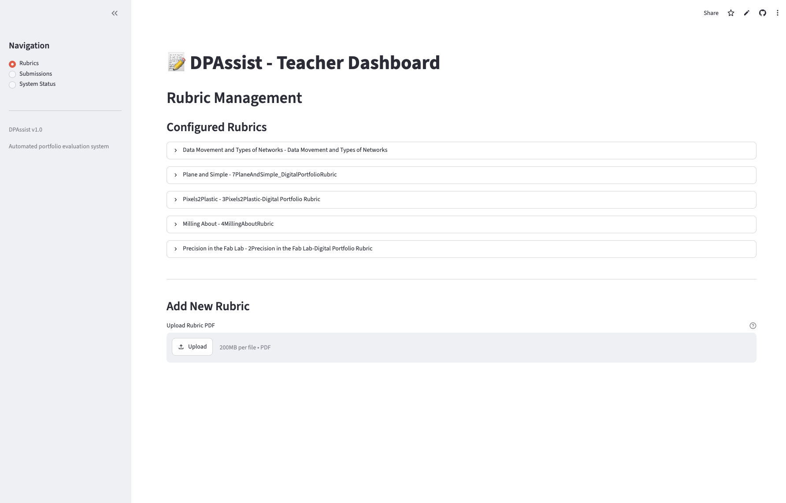
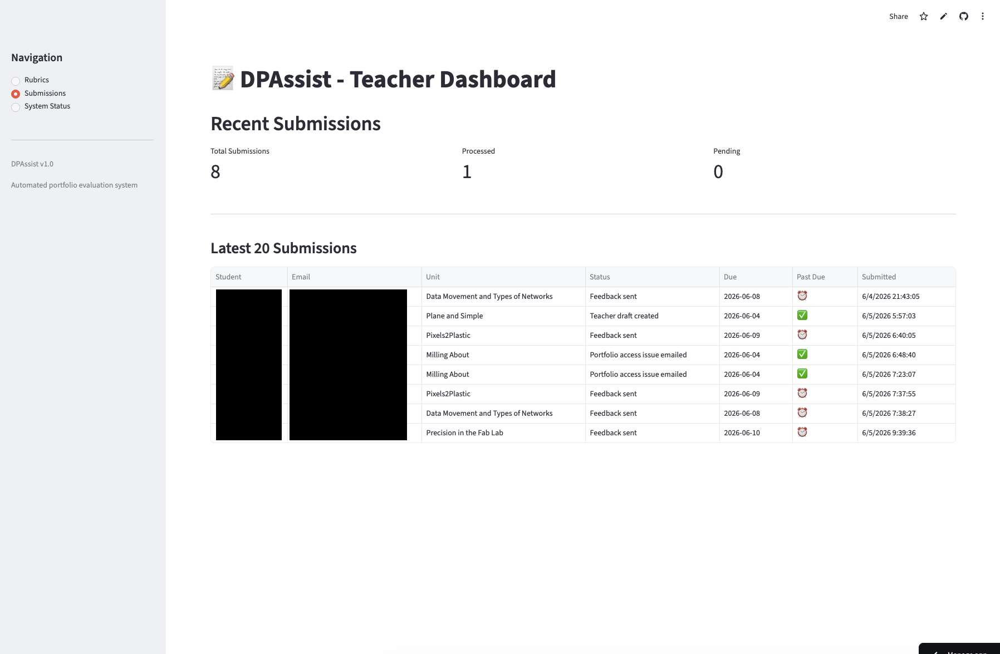

# DPAssist

## AI-Powered Portfolio Evaluation for Teachers

> **Built for educators who shouldn't have to choose between providing meaningful feedback and having time to teach.**

## Live Production System

🌐 **Teacher Dashboard**
https://dpassist-edu.streamlit.app

### Dashboard Preview

| Teacher Dashboard | Submissions Dashboard |
|------------------|----------------------|
|  |  |

📖 **[Open Teacher Setup Guide](https://bmorrow574.github.io/DPAssist/portfolio_reviewer/DPAssist_Teacher_Setup.html)**

🎥 **[Watch Summary Video](https://youtu.be/u0C-5i633i0)**

The cloud-hosted version of DPAssist is currently deployed and processing real student portfolio submissions.

---

## The Problem

Digital portfolio assignments are among the most valuable — and most time-consuming — assignments a teacher can give. A single class of 25 students, each submitting a multi-page portfolio, can easily require 10–15 hours of reading, grading, and writing individual feedback.

Teachers who want to give students the chance to revise and improve before a deadline face an impossible tradeoff:

* Spend evenings and weekends grading drafts
* Give little or no formative feedback
* Delay feedback until it is no longer useful

DPAssist solves this by automating the feedback loop while keeping the teacher in control of every final grade.

---

## What It Does

DPAssist is a cloud-hosted portfolio evaluation system consisting of:

* A Streamlit teacher dashboard
* A Render-hosted background worker
* Google Sheets integration
* Google Gemini AI evaluation

Teachers may also run the system locally if desired.

From the moment a student submits a portfolio link via Google Forms, the system takes over:

1. Detects the new submission from Google Sheets
2. Scrapes the portfolio website or repository
3. Evaluates the work against the teacher's rubric using Google Gemini
4. Sends actionable feedback to the student before the deadline
5. Creates a scored Gmail draft for the teacher after the deadline

The teacher uploads a rubric PDF once. After that, the workflow is automated.

---

## Key Design Decisions

### Evidence-First AI Evaluation

Most AI grading tools produce vague feedback that sounds encouraging but provides little instructional value.

DPAssist enforces strict evaluation rules:

* A criterion rated **Meets** must include an exact quote from the student's portfolio
* A criterion rated **Not Yet** must contain no evidence quotes
* **MEETS + low confidence is forbidden**
* The AI may not invent evidence
* Outputs are validated before feedback is delivered

If validation fails, the submission is flagged rather than producing inaccurate feedback.

### Two-Phase Feedback Model

| Phase            | Timing          | Recipient | Contains                                                          |
| ---------------- | --------------- | --------- | ----------------------------------------------------------------- |
| Student Feedback | Before deadline | Student   | Evidence-based improvement feedback without scores                |
| Teacher Draft    | After deadline  | Teacher   | Full rubric scores, summary comments, and grading recommendations |

By withholding scores before the deadline, students focus on improving their work rather than negotiating points.

### Rubric Parsing

Teachers upload existing PDF rubrics with no required reformatting.

Gemini extracts:

* Criteria
* Point values
* Performance levels
* Descriptors

A regex-based fallback parser provides additional resilience when AI extraction is unavailable.

### School Network Compatibility

Many schools restrict IMAP access.

DPAssist automatically falls back from Gmail draft creation to direct teacher email delivery when necessary, preventing silent failures.

---

## Architecture

```text
Student submits Google Form Portfolio Link (via Google Form)
        │
        ▼
┌─────────────────────┐
│   Google Sheets     │
└────────┬────────────┘
         │
         ▼
┌────────────────────────────┐
│ Render Background Worker   │
│ background_service.py      │
└──────────┬─────────────────┘
           │
      ┌────┴─────┐
      │          │
      ▼          ▼
┌──────────┐ ┌──────────┐
│ Scraper  │ │ Rubrics  │
└────┬─────┘ └────┬─────┘
     │            │
     └─────┬──────┘
           ▼
┌─────────────────────┐
│ Gemini Evaluator    │
│ + Validator         │
└─────────┬───────────┘
          │
     ┌────┴─────┐
     │          │
     ▼          ▼
 Student      Teacher
 Feedback      Draft
```

---

## Components

| File                  | Purpose                              |
| --------------------- | ------------------------------------ |
| background_service.py | Submission monitoring and processing |
| teacher_ui.py         | Streamlit teacher dashboard          |
| evaluator.py          | Gemini AI evaluation and validation  |
| rubric_parser.py      | PDF rubric extraction                |
| rubric_manager.py     | Rubric storage and retrieval         |
| scraper.py            | Portfolio content extraction         |
| email_service.py      | Student feedback email delivery      |
| gmail_drafts.py       | Teacher draft creation               |
| google_sheets.py      | Submission and rubric storage        |
| config.py             | Configuration management             |
| orchestrator/         | Evaluation pipeline                  |
| schemas/              | Structured validation models         |

---

## Technology Stack

| Layer             | Technology                |
| ----------------- | ------------------------- |
| AI Evaluation     | Google Gemini             |
| Teacher Dashboard | Streamlit Cloud           |
| Background Worker | Render                    |
| Storage           | Google Sheets             |
| Email Delivery    | Gmail SMTP / Gmail Drafts |
| Scraping          | BeautifulSoup4, Requests  |
| Runtime           | Python  3.9+                  |

---

## Deployment Options

### Cloud (Recommended)

Production deployment uses:

* Streamlit Cloud
* Render Background Worker
* Google Sheets
* Gmail
* Google Gemini

No local installation is required for teachers.

### Local Deployment

Advanced users may run DPAssist locally using Python.

---

## Setup

See **TEACHER_SETUP.md** for complete installation and deployment instructions.

### Requirements

* Google account
* Google Gemini API key
* Google Cloud service account
* Gmail account
* Google Sheets
* Google Forms 

### Developer Quick Start

```bash
pip install -r requirements.txt
cp .env.example .env
python teacher_ui.py
```

---

## Real-World Usage

DPAssist has been tested with actual student portfolio submissions at Charlotte Latin School.

Sample units successfully processed include:

* Milling About
* Data Movement and Types of Networks
* Pixels2Plastic
* Precision in the Fab Lab
* Plane and Simple

The system tracks processed submissions to prevent duplicate evaluations and duplicate email delivery.

---

## Production Status

DPAssist is currently deployed and processing live student submissions.

Production environment:

* Streamlit Cloud teacher dashboard
* Render-hosted background worker
* Google Sheets rubric storage
* Gmail student feedback delivery
* Gmail teacher draft creation
* Real student submissions successfully processed

The production system consists of a Streamlit Cloud teacher dashboard and a Render-hosted background worker connected through Google Sheets.

Successfully verified in production:

* Automated submission monitoring
* Rubric retrieval
* Gemini evaluation
* Student feedback delivery
* Teacher draft creation
* Cloud deployment

---

## Evaluation Rules

The AI evaluation layer enforces the following constraints:

```text
MEETS / PARTIALLY_MEETS
    → Must include evidence quote(s)

NOT_YET
    → Must include zero evidence quotes

MEETS + LOW CONFIDENCE
    → Rejected by validator

HIGH CONFIDENCE
    → Allowed only when evidence is complete
```

All rubric criteria must be evaluated exactly once.

Validation failures stop the workflow rather than allowing incomplete or inaccurate feedback to be sent.

---

## License

Proprietary — Educational Use Only

---

*DPAssist — because teachers' time is better spent teaching.*
